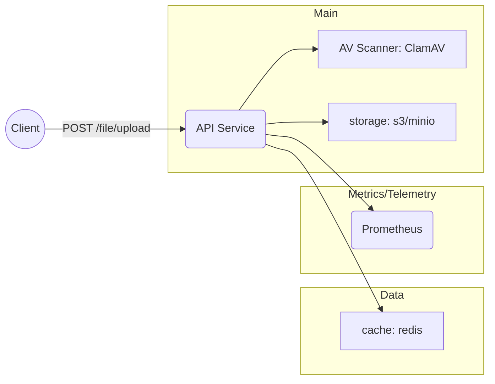

# Uplox · Secure Upload API in TypeScript 🚀
 


> **Upload once. Trust always.**

**Uplox** is a lightweight NodeJS + TypeScript micro-service that lets any application accept files _safely_ and _at scale_.
Born under the SEM mantra **Safe → Scale → Performance Excellent** (Levels 1-2), it ships with guard-rails on day-one yet grows effortlessly.

<!-- placeholder -->

---

## 🏃 Quick Start (Local dev ≤ 2 min)

```bash
git clone https://github.com/maxubrq/uplox
cd uplox
docker compose up -d   # boots app + minio + clamav + redis
pnpm run dev           # hot-reload development
```

| Method / Path                    | Purpose                                    |
|----------------------------------|--------------------------------------------|
| `POST /files/upload`             | Upload files with virus scanning          |
| `GET /files/:fileId/download`    | Get downloadable URL for a file           |
| `GET /files/:fileId/metadata`    | Get file metadata (size, hash, MIME type) |
| `GET /health`                    | Liveness & readiness probes                |
| `GET /metrics`                   | Prometheus exposition                      |

---

## 🏗 Architecture (v0.1.0)



- **zod** for all input; errors → RFC 9457 problem-details.
- S3 event or cron can trigger worker to run ✨ Magic Classifier.

---

## 🤔 Architecture Decision Log

[ADL](./docs/ADL.md)

---

## 🚀 One-Command Deploy

```bash
fly launch --image ghcr.io/your-org/uplox:0.1.0
```

CI template already:

- Lints + `tsc --noEmit`
- Vitest + comprehensive mocking (≥ 60 % L1, 80 % L2)
- Builds slim (≤ 150 MB) image & Trivy scan
- Publishes SBOM to GitHub-Dependabot

## 🤝 Contributing

PRs welcome! Run `npm run test:cov` and keep CI green.

## 📝 License

Apache-2.0 — fork, hack, ship securely.

---

**Uplox** lets your product say “yes” to file uploads without losing sleep over safety, scale or speed. Ready to plug it in? **Clone & deploy today!**
