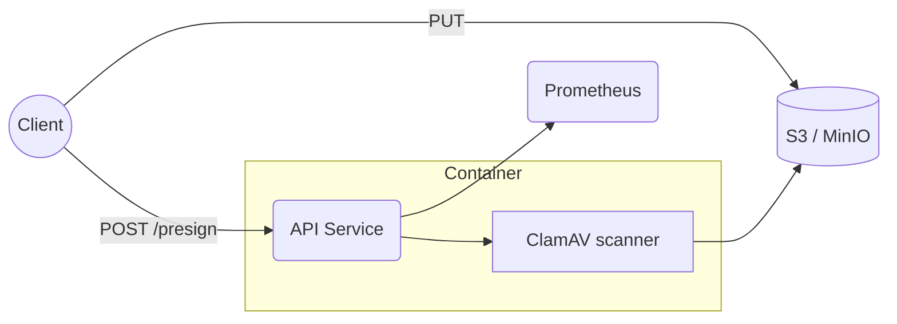

## Magic Kano Model – **Uplox (Secure Upload Service)**

| Category        | Feature                                                                                                                                                                                                                                                                                   | Why It Matters                                                                |
| --------------- | ----------------------------------------------------------------------------------------------------------------------------------------------------------------------------------------------------------------------------------------------------------------------------------------- | ----------------------------------------------------------------------------- |
| **Must-Have**   | • HTTPS-only & HSTS<br>• Max-size + MIME & magic-byte validation<br>• Inline ClamAV / ICAP virus scan                                                                                                                                                                                     | Baseline security & compliance – service is unusable without them             |
| **Performance** | • Zero-copy streaming to S3-compatible storage (no temp files)<br>• Presigned URL issued in ≤ 50 ms<br>• Adaptive rate-limit & back-pressure per API-key/IP                                                                                                                               | Directly affects throughput, cloud bill & user perception                     |
| **Attractive**  | • One-time download links that self-destruct<br>• Built-in image/video preview endpoint<br>• Webhook publishing full metadata (size, SHA-256, MIME)                                                                                                                                       | Removes extra glue work and delights integrators                              |
| **Indifferent** | • Dark-/Light-mode switch in future UI<br>• Multi-language UI strings (v1 skip)                                                                                                                                                                                                           | Adds little to core job-to-be-done for initial adopters                       |
| **Reverse**     | • Mandatory account registration for every upload<br>• Third-party ads in free tier                                                                                                                                                                                                       | Erodes trust; lowers conversion                                               |
| **Magic**       | ✨ Smart Content Classifier: auto-tag _photo / document / video_ and recommend lifecycle policy<br>✨ “Clean-Room” download: re-scan + strip EXIF + deliver fresh copy in one click<br>✨ Hash-locked presign CLI: generates URL containing size & SHA-256 so S3 rejects tampered uploads | Collapses 3–4 error-prone steps into one seamless action – feels like _magic_ |

---

# Uplox · Secure Upload API in TypeScript 🚀
n 

> **Upload once. Trust always.**

**Uplox** is a lightweight NodeJS + TypeScript micro-service that lets any application accept files _safely_ and _at scale_.
Born under the SEM mantra **Safe → Scale → Performance Excellent** (Levels 1-2), it ships with guard-rails on day-one yet grows effortlessly.

<!-- placeholder -->

---

## ✨ Key Features

| Pillar    | What You Get                                                                                                                  |
| --------- | ----------------------------------------------------------------------------------------------------------------------------- |
| **Safe**  | • End-to-end TLS, HSTS, CSP<br>• Virus scan before object finalises<br>• OWASP headers & rate-limit                           |
| **Scale** | • Streaming uploader → any S3 / MinIO<br>• Stateless; ready for horizontal scaling<br>• Prometheus metrics + JSON logs (pino) |
| **Perf**  | • Presign API < 50 ms P95<br>• Upload path zero-copy, constant memory<br>• Benchmark 1 000 RPS @ 150 ms on 512 MiB tier       |

---

## 🏃 Quick Start (Local dev ≤ 2 min)

```bash
git clone https://github.com/your-org/uplox
cd uplox
cp .env.example .env   # fill S3 + ClamAV creds
docker compose up -d   # boots app + minio + clamav
npm run dev            # hot-reload
```

| Method / Path   | Purpose                                             |
| --------------- | --------------------------------------------------- |
| `POST /presign` | Returns time-bound PUT URL _(body: filename, size)_ |
| `GET  /health`  | Liveness & readiness probes                         |
| `GET  /metrics` | Prometheus exposition                               |

---

## 🏗 Architecture (v0.1.0)



- **zod** for all input; errors → RFC 9457 problem-details.
- S3 event or cron can trigger worker to run ✨ Magic Classifier.

---

## 🚀 One-Command Deploy

```bash
fly launch --image ghcr.io/your-org/uplox:0.1.0
```

CI template already:

- Lints + `tsc --noEmit`
- Jest + Supertest (≥ 60 % L1, 80 % L2)
- Builds slim (≤ 150 MB) image & Trivy scan
- Publishes SBOM to GitHub-Dependabot

---

## 📊 Benchmarks & SEM Levels

| Metric             | Level 1 Target         | Level 2 Target           |
| ------------------ | ---------------------- | ------------------------ |
| Throughput (`PUT`) | 300 RPS · P95 < 250 ms | 1 000 RPS · P95 < 150 ms |
| Test coverage      | ≥ 60 % lines           | ≥ 80 % lines + branches  |
| Container size     | ≤ 300 MB               | ≤ 150 MB                 |
| Static vulns       | 0 critical             | 0 critical + 0 high      |
| Startup            | ≤ 2 s                  | ≤ 1 s                    |

Full scripts live in `bench/` (k6).

---

## 🌱 Roadmap

| Ver       | Milestone                                      | SEM Level    |
| --------- | ---------------------------------------------- | ------------ |
| **0.1.0** | Presign + ClamAV + Docker + CI                 | L1 pass      |
| **0.2.0** | Metrics, rate-limit, 1 k RPS load test         | L2 pass      |
| **0.3.0** | One-time links + Clean-Room download (Magic 1) | Bridge to L3 |

---

## 🤝 Contributing

PRs welcome! Run `npm run test:cov` and keep CI green.

## 📝 License

Apache-2.0 — fork, hack, ship securely.

---

**Uplox** lets your product say “yes” to file uploads without losing sleep over safety, scale or speed. Ready to plug it in? **Clone & deploy today!**
